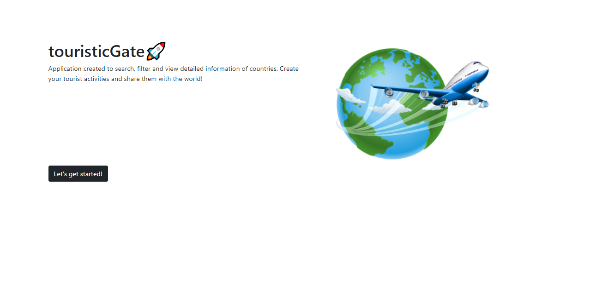
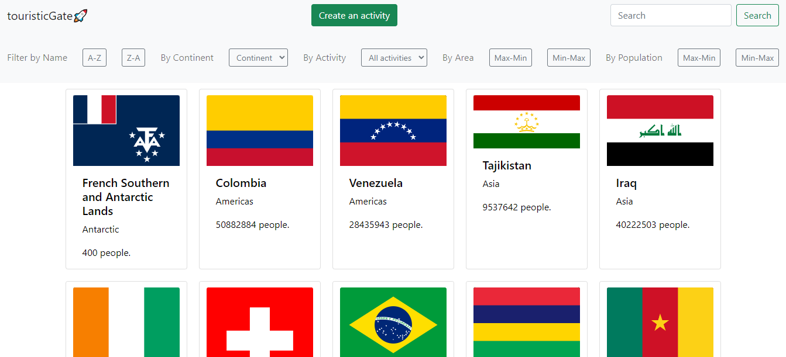

# Individual Project -  Countries app

  

## The Objetive 🦾
- Build an App using React, Redux, Node and Sequelize.
- Learn best practices.
- Learn and practice the GIT workflow.
- Use and practice testing.

## The Idea 💡

The general idea is to create an application in which you can see information from different countries using the external api [restcountries](https://restcountries.com/) and from there you can, among other things:

- Search countries
- Filter / Sort them
- Create tourist activities
## The Result 🚀
> https://touristicgate.vercel.app/

